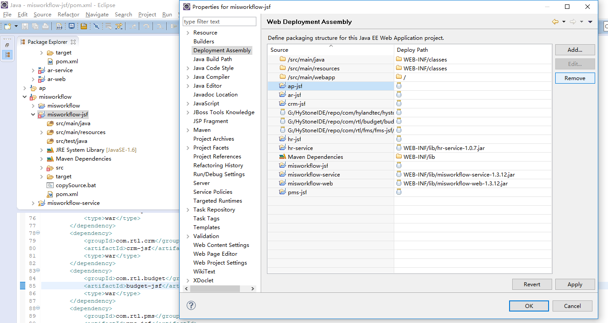
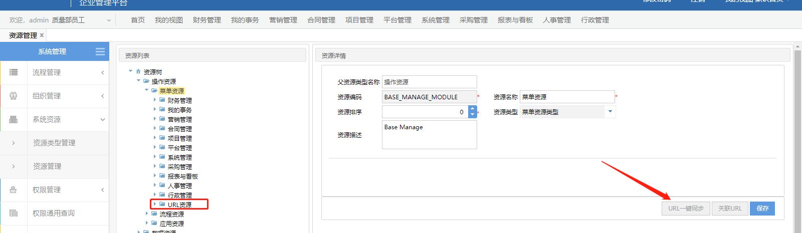

1. 日志文件

```
/root/jboss/standalone/log
```

2. 项目依赖关系
   
   pms->crm->ar->ap

3. 打包问题：
   - 关闭多余项目模块
   - Alt+enter。删除多余的target目录
     
     

4. 流程相关
   - 异常管理：系统管理->流程管理->异常管理
   - 流程管理
     - 查看流程节点所属页面
     - 查看流程节点所属适配器
     - 查看分派策略(一般海金操作)

5. 数据库表相关
   - PMS(项目管理)
     ```
     pms_project_base_info（项目基础表）、
     pms_project_belong_info(项目归属表)、
     项目报工审批表（pms_project_report_work_approve、pms_project_report_work_day_approve）、
     项目报工正式表（pms_project_report_work、pms_project_report_work_day）
     ```
   - WF/SYS(系统管理)
     ```
     sys_app_config(码表)、
     sys_mail(邮件表)、
     sys_mail_log（邮件日志表）、
     wf_staff（员工信息表）、
     hr_sap_employee_info（员工信息表登录相关）
     ```
6. 代码相关-流程
   - 主要包含留个webBean（*Apply.java,*Process.java）
   - init：页面初始化执行
   - provideProcessSubject：修改流程摘要信息
   - setProcessDtoValue：设置流程变量信息
   - provideBizData：设置流程实体信息
   - *Adapter：流程节点结束适配器

7.  代码相关-报工
   - Ws001ReportServiceImpl
   - 详见报工说明文档
8. 页面添加、系统授权显示
   - 添加菜单：系统管理->系统资源->资源管理（菜单管理右键新增菜单）
   - 添加菜单前，需进行URL资源一键同步
     
     
     
     